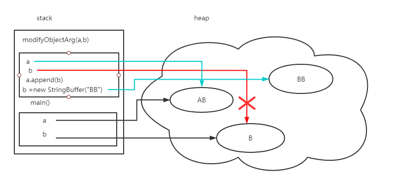

今日在刷leetcode（114. 二叉树展开为链表）过程中，出现空指针异常，之后发现原因是java只有值传递。

问题复现：

想在一个方法中，对入参（a = null）重新赋值（new TreeNode for a）,并在方法之外使用，碰到了空指针的问题。

于是梳理了一下java值传递的知识点，避免以后再入坑。


>java的官方解释为：
>Java always passes arguments by value, NOT by reference.

引用stack overflow的一个回答：
>Java is always pass by value, with no exceptions, ever.\
>So how is it that anyone can be at all confused by this, and believe that Java is pass by reference, or think they have an example of Java acting as pass by reference? The key point is that **Java never provides direct access to the values of objects themselves**, in any circumstances. The only access to objects is through a reference to that object. Because Java objects are always accessed through a reference, rather than directly, it is common to talk about fields and variables and method arguments as being objects, when pedantically they are only references to objects. The confusion stems from this (strictly speaking, incorrect) change in nomenclature.\
>So, when calling a method
>+ For primitive arguments (int, long, etc.), the pass by value is the actual value of the primitive (for example, 3).
>+ For objects, the pass by value is the value of the reference to the object.

元类型和引用类型的存储方式不同：

+ 原始数据类型的对象存放在栈中
+ 引用类型的对象存储在堆中,栈中存储的是tthe reference to the object(内存地址)

**举个栗子**

```java
public class Foo{
    public static void main(String [] args){
        int x = 3;
        double y = 100.1;
        StringBuffer a = new StringBuffer("A");
        StringBuffer b = new StringBuffer("B");
        modifyPrimitiveArg(x,y);
        modifyObjectArg(a, b);
        System.out.print("x: " + x + "\ny: " + y + "\na: " + a + "\nb: " + b);
    }

    private static void modifyPrimitiveArg(int x,double y){
        //when calling this method, it passes the actual value of x and y.
        x = 10;
        y = 111.1;
    }

    private static void modifyObjectArg(StringBuffer a, StringBuffer b){
        //when calling this method, it passes the value of the reference to the object, a and b.
        a.append(b);
        b = new StringBuffer("BB");
        // or b = a;
    }

}
```
结果为：\
x: 3\
y: 100.1\
a: AB\
b: B



b指向的对象仍为"B"，而不是"BB"。因为当modifyObjectArg()调用时, 两个形参a',b'分别被赋值为实参a,b提供的reference(值传递)。main()中的a、b指向的内存空间，并不能在其他方法中更改。

但在C/C++中，这是可以实现的，可以用指针的指针（**）或引用的指针（*&），来更改的指向的内存空间。

<br/>

参考：

[Java虚拟机—栈帧、操作数栈和局部变量表](https://zhuanlan.zhihu.com/p/45354152)

[c++ ** 和*&的区别](https://stackoverflow.com/questions/3834067/c-difference-between-and-in-parameter-passing)


