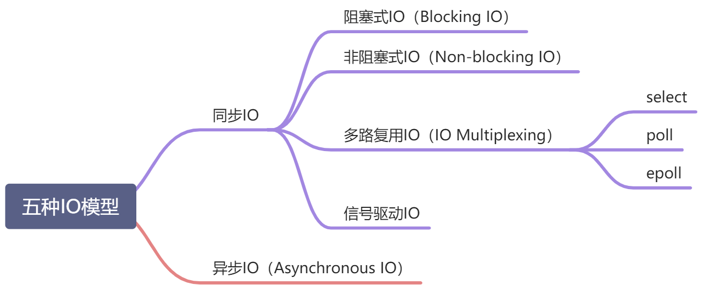
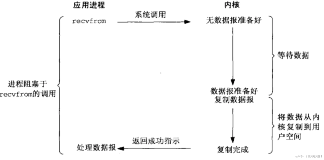
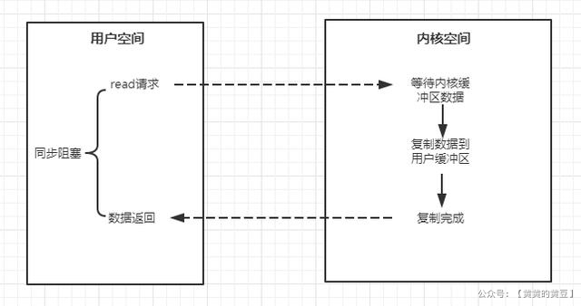
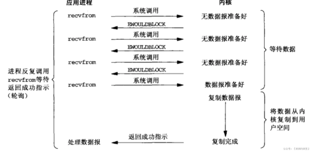
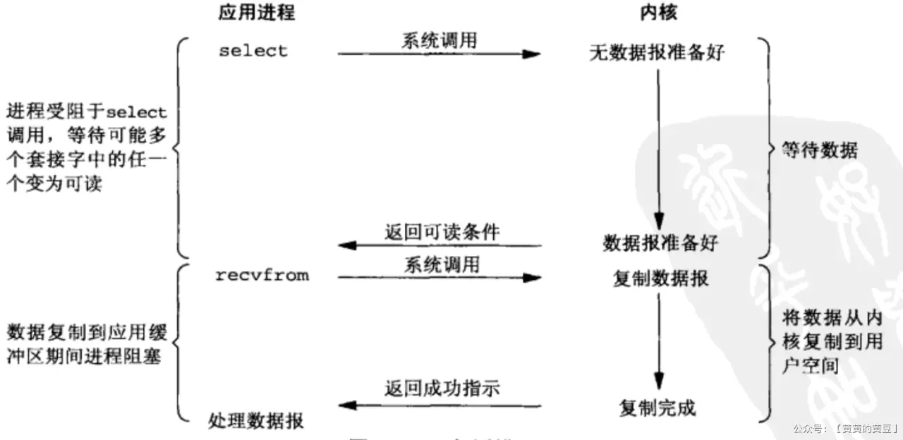
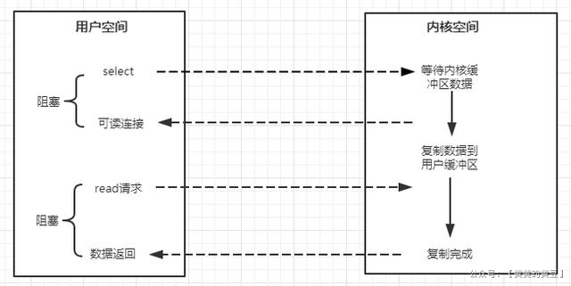
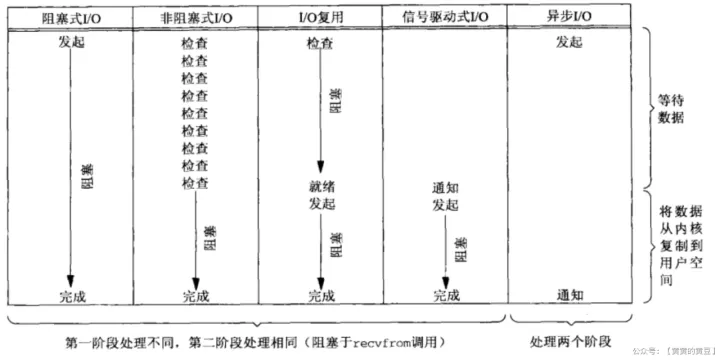

[Linux IO模式及 select、poll、epoll详解](https://www.cnblogs.com/duanxz/p/5155926.html)

[五种IO模型](https://www.yuque.com/gotaoey/vaeroo/iqdfgh)

### 五种IO模型

#### 阻塞式IO
+ 使用系统调用，并一直阻塞直到内核将数据准备好，之后再由内核缓冲区复制到用户态，在等待内核准备的这段时间什么也干不了
+ 下图函数调用期间，一直被阻塞，直到数据准备好且从内核复制到用户程序才返回，这种IO模型为阻塞式IO
+ java io包下的accept()和read()都是阻塞式的

优缺点

优点：开发简单，容易入门;在阻塞等待期间，用户线程挂起，在挂起期间不会占用CPU资源。

缺点：一个线程维护一个IO，不适合大并发，在并发量大的时候需要创建大量的线程来维护网络连接，内存、线程开销非常大。

#### 非阻塞式IO

+ 内核在没有准备好数据的时候会返回错误码，而调用程序不会休眠，而是不断轮询询问内核数据是否准备好
+ **下图函数调用时，如果数据没有准备好，不像阻塞式IO那样一直被阻塞，而是返回一个错误码（对应java代码中，返回null）。数据准备好时，函数成功返回。** (马士兵课中，有这个形式的代码：无selector的nio)。
+ 应用程序对这样一个非阻塞描述符循环调用成为轮询。
+ 非阻塞式IO的轮询会耗费大量cpu，通常在专门提供某一功能的系统中才会使用。通过为套接字的描述符属性设置非阻塞式，可使用该功能
  

优缺点

同步非阻塞IO优点：每次发起IO调用，在内核等待数据的过程中可以立即返回，用户线程不会阻塞，实时性较好。

同步非阻塞IO缺点：多个线程不断轮询内核是否有数据，占用大量CPU时间，效率不高。一般Web服务器不会采用此模式。

#### 多路复用IO

select，poll，epoll都是IO多路复用的机制。I/O多路复用就是通过一种机制，一个进程可以监视多个描述符，一旦某个描述符就绪（一般是读就绪或者写就绪），能够通知程序进行相应的读写操作。但select，poll，epoll本质上都是同步I/O，因为他们都需要在读写事件就绪后自己负责进行读写，也就是说这个读写过程是阻塞的，而异步I/O则无需自己负责进行读写，异步I/O的实现会负责把数据从内核拷贝到用户空间。（这里啰嗦下）

• **类似于非阻塞，只不过轮询不是由用户线程去执行，而是由内核去轮询，内核监听程序监听到数据准备好后，调用内核函数复制数据到用户态。**
• 下图中select这个系统调用，充当代理类的角色，不断轮询注册到它这里的所有需要IO的文件描述符，有结果时，把结果告诉被代理的recvfrom函数，它本尊再亲自出马去拿数据
• IO多路复用至少有两次系统调用，如果只有一个代理对象，性能上是不如前面的IO模型的，但是由于它可以同时监听很多套接字，所以性能比前两者高。

多路复用包括：

+ select：线性扫描所有监听的文件描述符，不管他们是不是活跃的。有最大数量限制（32位系统1024，64位系统2048）
+ poll：同select，不过数据结构不同，需要分配一个pollfd结构数组，维护在内核中。它没有大小限制，不过需要很多复制操作
+ epoll：用于代替poll和select，没有大小限制。使用一个文件描述符管理多个文件描述符，使用红黑树存储。同时**用事件驱动代替了轮询**。**epoll_ctl中,注册的文件描述符在事件触发的时候会通过回调机制激活该文件描述符。epoll_wait便会收到通知。** **最后，epoll还采用了mmap虚拟内存映射技术减少用户态和内核态数据传输的开销**

优缺点

IO多路复用优点：系统不必创建维护大量线程，只使用一个线程，一个选择器即可同时处理成千上万个连接，大大减少了系统开销。

IO多路复用缺点：本质上，select/epoll系统调用是阻塞式的，属于同步IO，需要在读写事件就绪后，由系统调用进行阻塞的读写。

select 198x年的一个阻塞式的函数，当然还可以配置超时时间来停止阻塞。
问题：
1. 维护一个1024的bitmap，不可重用，每次得重置
2. 用户态内核态切换、拷贝
3. 遍历整个rset(bitmap),挑出ready的socket。时间复杂度 O(n)。

poll和select的完成思路类似。但不使用bitmap了，使用一个结构体的数组。结构体为pollfd。
解决了上述的1.问题，但2.3.没有解决

epoll会将ready的事件重排到头部，不需要遍历整个数组。时间复杂度为O(m)，m为ready事件的数量。
底层存储结构是红黑树，会有水平触发、边缘触发两种模式。
并且实现内核态和用户态的buffer内存共享，不需要拷贝了。

redis、ngix、java nio底层都是用的epoll。

#### 几种io模型的对比

