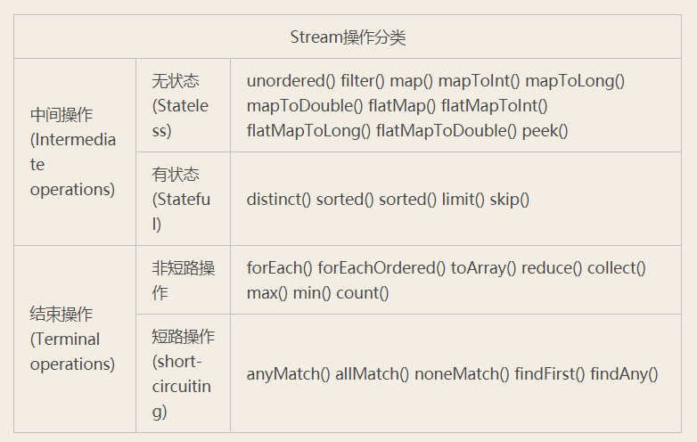

### Java8的Stream
[Java 8 Stream Tutorial](https://winterbe.com/posts/2014/07/31/java8-stream-tutorial-examples/)

[csdn: 尚硅谷java8新特性](https://blog.csdn.net/weixin_45225595/article/details/106203264)


[博客园：深入理解Java8中Stream的实现原理](https://www.cnblogs.com/sunshinekevin/p/11576893.html)

```java
int longestStringLengthStartingWithA
        = strings.stream()
              .filter(s -> s.startsWith("A"))
              .mapToInt(String::length)
              .max();
```

上述代码求出以字母A开头的字符串的最大长度，一种直白的方式是为每一次函数调用都执一次迭代，这样做能够实现功能，但效率上肯定是无法接受的。类库的实现着使用流水线（Pipeline）的方式巧妙的避免了多次迭代，其基本思想是在**一次迭代中尽可能多的执行用户指定的操作**。为讲解方便我们汇总了Stream的所有操作。




Stream上的所有操作分为两类：中间操作和结束操作。

中间操作只是一种标记，只有结束操作才会触发实际计算。中间操作又可以分为无状态的(Stateless)和有状态的(Stateful)，无状态中间操作是指元素的处理不受前面元素的影响，而有状态的中间操作必须等到所有元素处理之后才知道最终结果，比如排序是有状态操作，在读取所有元素之前并不能确定排序结果

结束操作又可以分为短路操作和非短路操作，短路操作是指不用处理全部元素就可以返回结果，比如找到第一个满足条件的元素。

之所以要进行如此精细的划分，是因为底层对每一种情况的处理方式不同。 为了更好的理解流的中间操作和终端操作，可以通过下面的两段代码来看他们的执行过程。
```java
IntStream.range(1, 10)
   .peek(x -> System.out.print("\nA" + x))
   .limit(3)
   .peek(x -> System.out.print("B" + x))
   .forEach(x -> System.out.print("C" + x));
```
输出为： A1B1C1 A2B2C2 A3B3C3 中间操作是懒惰的，也就是中间操作不会对数据做任何操作，直到遇到了最终操作。而最终操作，都是比较热情的。他们会往前回溯所有的中间操作。也就是当执行到最后的forEach操作的时候，它会回溯到它的上一步中间操作，上一步中间操作，又会回溯到上上一步的中间操作，...，直到最初的第一步。 第一次forEach执行的时候，会回溯peek 操作，然后peek会回溯更上一步的limit操作，然后limit会回溯更上一步的peek操作，顶层没有操作了，开始自上向下开始执行，输出：A1B1C1 第二次forEach执行的时候，然后会回溯peek 操作，然后peek会回溯更上一步的limit操作，然后limit会回溯更上一步的peek操作，顶层没有操作了，开始自上向下开始执行，输出：A2B2C2

... **当第四次forEach执行的时候，然后会回溯peek 操作，然后peek会回溯更上一步的limit操作，到limit的时候，发现limit(3)这个job已经完成，这里就相当于循环里面的break操作，跳出来终止循环。**

再来看第二段代码：
```java
IntStream.range(1, 10)
   .peek(x -> System.out.print("\nA" + x))
   .skip(6)
   .peek(x -> System.out.print("B" + x))
   .forEach(x -> System.out.print("C" + x));
```

输出为： A1 A2 A3 A4 A5 A6 A7B7C7 A8B8C8 A9B9C9 第一次forEach执行的时候，会回溯peek操作，然后peek会回溯更上一步的skip操作，skip回溯到上一步的peek操作，顶层没有操作了，开始自上向下开始执行，执行到skip的时候，**因为执行到skip，这个操作的意思就是跳过，下面的都不要执行了，也就是就相当于循环里面的continue**，结束本次循环。输出：A1

`skip(6)`代表跳过六次

第二次forEach执行的时候，会回溯peek操作，然后peek会回溯更上一步的skip操作，skip回溯到上一步的peek操作，顶层没有操作了，开始自上向下开始执行，执行到skip的时候，**发现这是第二次skip，结束本次循环。**输出：A2

...

第七次forEach执行的时候，会回溯peek操作，然后peek会回溯更上一步的skip操作，skip回溯到上一步的peek操作，顶层没有操作了，开始自上向下开始执行，**执行到skip的时候，发现这是第七次skip，已经大于6了，它已经执行完了skip(6)的job了。这次skip就直接跳过，继续执行下面的操作。输出：A7B7C7**

...直到循环结束。


```java

     Stream.of("one", "two", "three", "four")
        .filter(e -> e.length() > 3)
        .peek(e -> System.out.println("Filtered value: " + e))
        .map(String::toUpperCase)
        .peek(e -> System.out.println("Mapped value: " + e))
        .collect(Collectors.toList());

    //result:
    /**
    *
    *Filtered value: three
    *Mapped value: THREE
    *Filtered value: four
    *Mapped value: FOUR
    */
```

[Java 8 Stream Tutorial](https://winterbe.com/posts/2014/07/31/java8-stream-tutorial-examples/)

### Reusing Streams
Java 8 streams cannot be reused. As soon as you call any terminal operation the stream is closed:
```java
Stream<String> stream =
    Stream.of("d2", "a2", "b1", "b3", "c")
        .filter(s -> s.startsWith("a"));

stream.anyMatch(s -> true);    // ok
stream.noneMatch(s -> true);   // exception
```
Calling noneMatch after anyMatch on the same stream results in the following exception:
```java
java.lang.IllegalStateException: stream has already been operated upon or closed
    at java.util.stream.AbstractPipeline.evaluate(AbstractPipeline.java:229)
    at java.util.stream.ReferencePipeline.noneMatch(ReferencePipeline.java:459)
    at com.winterbe.java8.Streams5.test7(Streams5.java:38)
    at com.winterbe.java8.Streams5.main(Streams5.java:28)
```

To overcome this limitation we have to to create a new stream chain for every terminal operation we want to execute, e.g. we could create a stream supplier to construct a new stream with all intermediate operations already set up:

```java
Supplier<Stream<String>> streamSupplier =
    () -> Stream.of("d2", "a2", "b1", "b3", "c")
            .filter(s -> s.startsWith("a"));

streamSupplier.get().anyMatch(s -> true);   // ok
streamSupplier.get().noneMatch(s -> true);  // ok
```

In order to transform the stream elements into a map, we have to specify how both the keys and the values should be mapped. Keep in mind that the mapped keys must be unique, otherwise an IllegalStateException is thrown. You can optionally pass a merge function as an additional parameter to bypass the exception:
```java
Map<Integer, String> map = persons
    .stream()
    .collect(Collectors.toMap(
        p -> p.age,
        p -> p.name,
        (name1, name2) -> name1 + ";" + name2));

System.out.println(map);
// {18=Max, 23=Peter;Pamela, 12=David}
```

### FlatMap
We've already learned how to transform the objects of a stream into another type of objects by utilizing the map operation. Map is kinda limited because every object can only be mapped to exactly one other object. But what if we want to transform one object into multiple others or none at all? This is where flatMap comes to the rescue.

FlatMap transforms each element of the stream into a stream of other objects. So **each object will be transformed into zero, one or multiple other objects backed by streams.** The contents of those streams will then be placed into the returned stream of the flatMap operation.

Before we see flatMap in action we need an appropriate type hierarchy:
```java
class Foo {
    String name;
    List<Bar> bars = new ArrayList<>();

    Foo(String name) {
        this.name = name;
    }
}

class Bar {
    String name;

    Bar(String name) {
        this.name = name;
    }
}
```
Next, we utilize our knowledge about streams to instantiate a couple of objects:
```java
List<Foo> foos = new ArrayList<>();

// create foos
IntStream
    .range(1, 4)
    .forEach(i -> foos.add(new Foo("Foo" + i)));

// create bars
foos.forEach(f ->
    IntStream
        .range(1, 4)
        .forEach(i -> f.bars.add(new Bar("Bar" + i + " <- " + f.name))));
```
Now we have a list of three foos each consisting of three bars.

FlatMap accepts a function which has to return a stream of objects. So in order to resolve the bar objects of each foo, we just pass the appropriate function:
```java
foos.stream()
    .flatMap(f -> f.bars.stream())
    .forEach(b -> System.out.println(b.name));

// Bar1 <- Foo1
// Bar2 <- Foo1
// Bar3 <- Foo1
// Bar1 <- Foo2
// Bar2 <- Foo2
// Bar3 <- Foo2
// Bar1 <- Foo3
// Bar2 <- Foo3
// Bar3 <- Foo3
```

As you can see, we've successfully transformed the stream of three foo objects into a stream of nine bar objects.

Finally, the above code example can be simplified into a single pipeline of stream operations:
```java
IntStream.range(1, 4)
    .mapToObj(i -> new Foo("Foo" + i))
    .peek(f -> IntStream.range(1, 4)
        .mapToObj(i -> new Bar("Bar" + i + " <- " f.name))
        .forEach(f.bars::add))
    .flatMap(f -> f.bars.stream())
    .forEach(b -> System.out.println(b.name));
```

FlatMap is also available for the Optional class introduced in Java 8. Optionals flatMap operation returns an optional object of another type. So it can be utilized to prevent nasty null checks.

FlatMap is also available for the Optional class introduced in Java 8. Optionals flatMap operation returns an optional object of another type. So it can be utilized to prevent nasty null checks.

Think of a highly hierarchical structure like this:
```java
class Outer {
    Nested nested;
}

class Nested {
    Inner inner;
}

class Inner {
    String foo;
}

```
In order to resolve the inner string foo of an outer instance you have to add multiple null checks to prevent possible NullPointerExceptions:
```java
Outer outer = new Outer();
if (outer != null && outer.nested != null && outer.nested.inner != null) {
    System.out.println(outer.nested.inner.foo);
}
```
The same behavior can be obtained by utilizing optionals flatMap operation:
```java
Optional.of(new Outer())
    .flatMap(o -> Optional.ofNullable(o.nested))
    .flatMap(n -> Optional.ofNullable(n.inner))
    .flatMap(i -> Optional.ofNullable(i.foo))
    .ifPresent(System.out::println);
```
Each call to flatMap returns an Optional wrapping the desired object if present or null if absent.

### Reduce
The reduction operation combines all elements of the stream into a single result. Java 8 supports three different kind of reduce methods. The first one reduces a stream of elements to exactly one element of the stream. Let's see how we can use this method to determine the oldest person:
```java
persons
    .stream()
    .reduce((p1, p2) -> p1.age > p2.age ? p1 : p2)//传入accumulater
    .ifPresent(System.out::println);    // Pamela

```

The reduce method accepts a BinaryOperator accumulator function. That's actually a BiFunction where both operands share the same type, in that case Person. BiFunctions are like Function but accept two arguments. The example function compares both persons ages in order to return the person with the maximum age.

The second reduce method accepts both an identity value and a BinaryOperator accumulator. This method can be utilized to construct a new Person with the aggregated names and ages from all other persons in the stream:
```java
Person result =
    persons
        .stream()
        .reduce(new Person("", 0), (p1, p2) -> {
            p1.age += p2.age;
            p1.name += p2.name;
            return p1;
        });

System.out.format("name=%s; age=%s", result.name, result.age);
// name=MaxPeterPamelaDavid; age=76
```
The third reduce method accepts three parameters: an identity value, a BiFunction accumulator and a combiner function of type BinaryOperator. Since the identity values type is not restricted to the Person type, we can utilize this reduction to determine the sum of ages from all persons:

```java
Integer ageSum = persons
    .stream()
    .reduce(0, (sum, p) -> sum += p.age, (sum1, sum2) -> sum1 + sum2);

System.out.println(ageSum);  // 76

```
### Parallel Streams

Streams can be executed in parallel to increase runtime performance on large amount of input elements. Parallel streams use a common ForkJoinPool available via the static ForkJoinPool.commonPool() method. The size of the underlying thread-pool uses up to five threads - depending on the amount of available physical CPU cores:
```java
ForkJoinPool commonPool = ForkJoinPool.commonPool();
System.out.println(commonPool.getParallelism());    // 3
```
On my machine the common pool is initialized with a parallelism of 3 per default. This value can be decreased or increased by setting the following JVM parameter:
```java
-Djava.util.concurrent.ForkJoinPool.common.parallelism=5
```
Collections support the method parallelStream() to create a parallel stream of elements. Alternatively you can call the intermediate method parallel() on a given stream to convert a sequential stream to a parallel counterpart.

In order to understate the parallel execution behavior of a parallel stream the next example prints information about the current thread to sout:
```java
Arrays.asList("a1", "a2", "b1", "c2", "c1")
    .parallelStream()
    .filter(s -> {
        System.out.format("filter: %s [%s]\n",
            s, Thread.currentThread().getName());
        return true;
    })
    .map(s -> {
        System.out.format("map: %s [%s]\n",
            s, Thread.currentThread().getName());
        return s.toUpperCase();
    })
    .forEach(s -> System.out.format("forEach: %s [%s]\n",
        s, Thread.currentThread().getName()));
```
By investigating the debug output we should get a better understanding which threads are actually used to execute the stream operations:
```java
filter:  b1 [main]
filter:  a2 [ForkJoinPool.commonPool-worker-1]
map:     a2 [ForkJoinPool.commonPool-worker-1]
filter:  c2 [ForkJoinPool.commonPool-worker-3]
map:     c2 [ForkJoinPool.commonPool-worker-3]
filter:  c1 [ForkJoinPool.commonPool-worker-2]
map:     c1 [ForkJoinPool.commonPool-worker-2]
forEach: C2 [ForkJoinPool.commonPool-worker-3]
forEach: A2 [ForkJoinPool.commonPool-worker-1]
map:     b1 [main]
forEach: B1 [main]
filter:  a1 [ForkJoinPool.commonPool-worker-3]
map:     a1 [ForkJoinPool.commonPool-worker-3]
forEach: A1 [ForkJoinPool.commonPool-worker-3]
forEach: C1 [ForkJoinPool.commonPool-worker-2]
```
As you can see the parallel stream utilizes all available threads from the common ForkJoinPool for executing the stream operations. The output may differ in consecutive runs because the behavior which particular thread is actually used is non-deterministic.
Let's extend the example by an additional stream operation, sort:
```java
Arrays.asList("a1", "a2", "b1", "c2", "c1")
    .parallelStream()
    .filter(s -> {
        System.out.format("filter: %s [%s]\n",
            s, Thread.currentThread().getName());
        return true;
    })
    .map(s -> {
        System.out.format("map: %s [%s]\n",
            s, Thread.currentThread().getName());
        return s.toUpperCase();
    })
    .sorted((s1, s2) -> {
        System.out.format("sort: %s <> %s [%s]\n",
            s1, s2, Thread.currentThread().getName());
        return s1.compareTo(s2);
    })
    .forEach(s -> System.out.format("forEach: %s [%s]\n",
        s, Thread.currentThread().getName()));

```
The result may look strange at first:
```java
filter:  c2 [ForkJoinPool.commonPool-worker-3]
filter:  c1 [ForkJoinPool.commonPool-worker-2]
map:     c1 [ForkJoinPool.commonPool-worker-2]
filter:  a2 [ForkJoinPool.commonPool-worker-1]
map:     a2 [ForkJoinPool.commonPool-worker-1]
filter:  b1 [main]
map:     b1 [main]
filter:  a1 [ForkJoinPool.commonPool-worker-2]
map:     a1 [ForkJoinPool.commonPool-worker-2]
map:     c2 [ForkJoinPool.commonPool-worker-3]
sort:    A2 <> A1 [main]
sort:    B1 <> A2 [main]
sort:    C2 <> B1 [main]
sort:    C1 <> C2 [main]
sort:    C1 <> B1 [main]
sort:    C1 <> C2 [main]
forEach: A1 [ForkJoinPool.commonPool-worker-1]
forEach: C2 [ForkJoinPool.commonPool-worker-3]
forEach: B1 [main]
forEach: A2 [ForkJoinPool.commonPool-worker-2]
forEach: C1 [ForkJoinPool.commonPool-worker-1]
```
It seems that sort is executed sequentially on the main thread only. Actually, sort on a parallel stream uses the new Java 8 method `Arrays.parallelSort()` under the hood. As stated in Javadoc this method decides on the length of the array if sorting will be performed sequentially or in parallel:
>If the length of the specified array is less than the minimum granularity, then it is sorted using the appropriate Arrays.sort method.
在parallel stream中，sort方法实际底层使用了`Arrays.parallelSort()`
根据数组长度来决定是串行还是并行。

Coming back to the reduce example from the last section. We already found out that the combiner function is only called in parallel but not in sequential streams. Let's see which threads are actually involved: 看原文

In summary, it can be stated that parallel streams can bring be a nice performance boost to streams with a large amount of input elements. **But keep in mind that some parallel stream operations like `reduce` and `collect` need additional computations (combine operations) which isn't needed when executed sequentially.**

Furthermore we've learned that all parallel stream operations share the same JVM-wide common ForkJoinPool. So you probably want to avoid implementing slow blocking stream operations since that could potentially slow down other parts of your application which rely heavily on parallel streams.