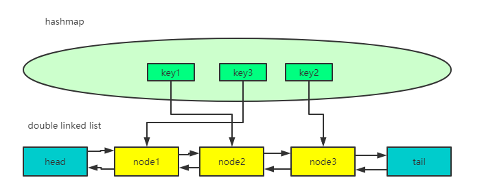
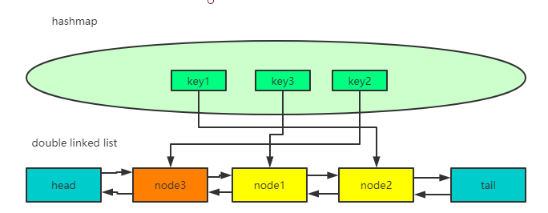

### LRU是什么

现代计算机，内存仍是相当昂贵的，那么如果利用好、管理好有限的内存，来为用户提供更好的性能，是一个有意义的议题。

LRU(Least Recently Used) 即最近最少使用，属于典型的内存淘汰机制。

通俗的说，LRU算法认为，最近被频繁访问的数据会具备更高的留存，淘汰那些不常被访问的数据。

### LRU算法实现思路

根据LRU算法的理念，我们需要：
一个参数cap来作为最大容量
一种数据结构来存储数据，并且需要1. 轻易地更新最新的访问的数据。2. 轻易地找出最近最少被使用的数据，当到达cap时，清理掉。
在这里，我们用到的数据结构是：hashmap+双向链表。
1.利用hashmap的get、put方法O(1)的时间复杂度，快速取、存数据。
2.利用doublelinkedlist的特征（可以访问到某个节点之前和之后的节点），实现O(1)的新增和删除数据。

如下图所示：



当key2再次被使用时，它所对应的node3被更新到链表头部



假设cap=3，当key4创建、被访问后，处于链表尾部的node2将被淘汰，key1将被清楚。

### LRU的实现

节点node,存放key、val值、前节点、后节点
```java
class Node{
    public int key;
    public int val;
    public Node next;
    public Node previous;

    public Node() {
    }

    public Node(int key, int val) {
        this.key = key;
        this.val = val;
    }
}
```

双向链表，属性有size、头节点、尾节点。
提供api：
+ addFirst(): 头插法入链表
+ remove(): 删除最后一个节点
+ remove(Node node):删除特定节点
+ size()：获取链表长度
```java
class DoubleList{
    private int size;
    private Node head;
    private Node tail;

    public DoubleList() {
        this.head = new Node();
        this.tail = new Node();
        size = 0;
        head.next = tail;
        tail.previous = head;
    }

    public void addFirst(Node node){
        Node temp = head.next;
        head.next = node;
        node.previous = head;
        node.next = temp;
        temp.previous = node;
        size++;
    }

    public void remove(Node node){
        if(null==node|| node.previous==null|| node.next==null){
            return;
        }

        node.previous.next = node.next;
        node.next.previous = node.previous;
        node.next=null;
        node.previous=null;
        size--;
    }

    public void remove(){
        if(size<=0) return;
        Node temp = tail.previous;
        temp.previous.next = temp.next;
        tail.previous = temp.previous;
        temp.next = null;
        temp.previous=null;
        size--;
    }

    public int size(){
        return size;
    }
}
```
LRU算法实现类
API
+ get(int key): 为null返回-1
+ put(int key, int value)
  + 若map中有，删除原节点，增加新节点
  + 若map中没有，map和链表中新增新数据。
```java
public class LRUCache {

    Map<Integer,Node> map;
    DoubleList cache;
    int cap;


    public LRUCache(int cap) {
        map = new HashMap<>();
        cache = new DoubleList();
        this.cap = cap;
    }

    public int get(int key){
        Node node = map.get(key);
        return  node==null? -1:node.val;

    }

    public void put(int key, int val){
        Node node = new Node(key,val);
        if(map.get(key)!=null){
            cache.remove(map.get(key));
            cache.addFirst(node);
            map.put(key,node);
            return;
        }

        map.put(key,node);
        cache.addFirst(node);
        if(cache.size()>cap){
            cache.remove();
        }

    }

    public static void main(String[] args) {
        //test, cap = 3
        LRUCache lruCache = new LRUCache(3);
        lruCache.put(1,1);
        lruCache.put(2,2);
        lruCache.put(3,3);
        //<1,1>来到链表头部
        lruCache.put(1,1);
        //<4,4>来到链表头部， <2,2>被淘汰。
        lruCache.put(4,4);
    }

}

```

#### LRU应用场景

+ 底层的内存管理，页面置换算法
+ 一般的缓存服务，memcache\redis之类
+ 部分业务场景


#### 参考
[LRU 策略详解和实现](https://leetcode-cn.com/problems/lru-cache/solution/lru-ce-lue-xiang-jie-he-shi-xian-by-labuladong/)

[LRU原理以及应用场景](http://doumaomao.github.io/blog/LRU%E5%8E%9F%E7%90%86%E4%BB%A5%E5%8F%8A%E5%BA%94%E7%94%A8%E5%9C%BA%E6%99%AF.html)